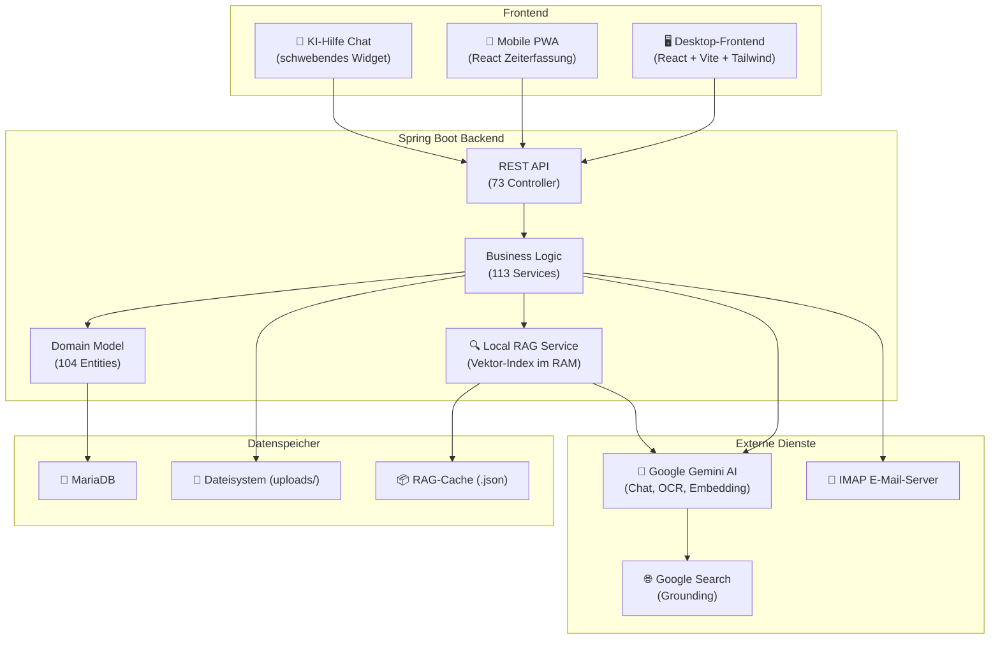

<p align="center">
  
</p>

<h1 align="center">Handwerkerprogramm</h1>

<p align="center">
  <strong>Das Open-Source-ERP, das für Handwerksbetriebe gebaut wurde – nicht an sie angepasst.</strong><br/>
  Angebote kalkulieren. Zeiten erfassen. Rechnungen stellen. Projekte nachkalkulieren. Alles in einer Anwendung.
</p>

<p align="center">
  
  
  
  
  
  
  
</p>

<div align="center">

| Metric | Value |
|--------|-------|
| ⭐ Stars |  |
| 🍴 Forks |  |

</div>

<p align="center">
  ⭐ <strong>Gefällt dir das Projekt? Ein Stern hilft dabei, dass mehr Handwerksbetriebe dieses Tool finden!</strong>
</p>

<br/>

<p align="center">
  <strong>🖥️ Desktop-Frontend</strong>
</p>
<p align="center">
  
</p>

<br/>

<p align="center">
  <strong> Automatische Zeitkalkulation per Linearer Regression</strong>
</p>
<p align="center">
  
</p>

<br/>

<p align="center">
  <strong>📱 Mobile App (PWA)</strong>
</p>
<p align="center">
  
</p>

<br/>

<p align="center">
  <strong>📝 Dokumenteditor – Block-basierte Angebots- & Rechnungserstellung</strong>
</p>
<p align="center">
  
</p>

---

## 🙋 Über dieses Projekt

Ich habe dieses Programm entwickelt, um meinem Vater in seinem Handwerksbetrieb zu helfen. Was als kleines Tool zur Projektkalkulation begann, ist über die Zeit zu einem vollständigen ERP-System gewachsen – mit eingebautem KI-Assistenten, automatischer Zeitkalkulation, Echtzeit-Nachkalkulation, E-Mail-Integration und vielem mehr.

Ich studiere **Wirtschaftsinformatik im 4. Semester** und habe das Projekt durch **Pair-Programming mit Claude (AI)** entwickelt. Jetzt möchte ich es als Open Source verfügbar machen, damit auch andere Handwerksbetriebe davon profitieren können.

---

## 🔗 Lead-to-Cash in einem System

Vom Website-Besucher bis zur Schlussrechnung – alles in einem geschlossenen Loop:

```text
Website-Besucher
   ↓ Anfrage-Formular (Cloudflare-Tunnel + Spam-Filter VOR Persistenz)
   ↓ Auto-Push an zuständige Mitarbeiter, Auto-Bestätigungsmail an Lead
Sammel-Container für Eingangs-Mails & Fotos zur Anfrage
   ↓ Konvertierung zum Projekt – Notizen & Bilder wandern automatisch ins Bautagebuch
ProjektEditor mit Live-Vor- & Nachkalkulation aus 4 Quellen
   (Zeit + Material + Artikel + Eingangsrechnung)
   ↓ Angebot → Digitale Freigabe per Snapshot-Hash
ZUGFeRD/XRechnung-Versand (EN 16931) direkt aus dem Dokumenteditor
   ↓ Multi-Kostenstellen-Split & Verrechnungslohn-BAB
Lineare Regression lernt aus echter Zeit → kalibriert die nächste Kalkulation
```

Das ist kein „ERP mit netten Features" – es ist ein **integriertes Business-Betriebssystem für Handwerksbetriebe**.

### 19 Highlights auf einen Blick

| # | Feature |
| --- | --- |
| 1 | **KI-Assistent mit RAG auf dem eigenen Code** – kontextbewusst, kennt jede Seite, jede Funktion, jeden Workflow |
| 2 | **KI-Eingangsrechnungs-Analyse** – ZUGFeRD-XML zuerst, dann Gemini-OCR-Fallback, automatische Lieferanten-Zuordnung |
| 3 | **Google Search Grounding** – DIN-Normen, Materialdaten, Wetter für Baustellen direkt im KI-Chat |
| 4 | **E-Mail-Auto-Import** – IMAP-Polling 60 s, Anhänge werden direkt analysiert und an offene Bestellungen angedockt |
| 5 | **ZUGFeRD/XRechnung-Versand** (EN 16931) direkt aus dem Dokumenteditor |
| 6 | **Multi-Quellen-Materialkosten** – manuell + Artikel + Eingangsrechnung fließen automatisch in dasselbe Projekt |
| 7 | **4-Stufen-Bestellkette** – Anfrage → Bestellung → Rechnung eingegangen → Zugeordnet, durchgehend verfolgt |
| 8 | **Lineare Regression auf echten Zeiten** – Programm lernt mit jedem Projekt mit, nach Kategorie + Arbeitsgang aufgelöst |
| 9 | **Controlling-Dashboard mit PLZ-Heatmap & Umsatz-Vorjahresvergleich** – Echtzeit-KPIs |
| 10 | **Offline-First-Mobile-PWA** inkl. Bautagebuch, Reklamation, Lieferschein-Scan mit Perspektivkorrektur |
| 11 | **Sammel-Container für Anfragen** – Eingangs-Mails und Fotos zur Anfrage sammeln, bevor sie zum Projekt werden |
| 12 | **Block-basierter Dokumenteditor** mit Live-PDF, GAEB-Import, 7 Dokumenttypen aus einem Editor |
| 13 | **Digitale Angebots-Freigabe per Snapshot-Hash** – revisionssicher, GoBD-konform |
| 14 | **Eingangsrechnung → Multi-Projekt/Kostenstellen-Split** prozentual oder absolut, mit Auto-Restbetrag |
| 15 | **Live-Nachkalkulation aus 4 Quellen** – Gewinn wird rot, sobald er negativ wird |
| 16 | **Bautagebuch + Anfrage-Tagebuch** – durchgehend ab der Anfrage, Auto-Transfer ins Projekt |
| 17 | **Website-Anfrage-Funnel End-to-End** – Cloudflare-Tunnel → Spam-Filter → Kunden-Dedup → Push → Auto-Mail |

---

## 🚀 Was dieses ERP besonders macht

> Die meisten ERP-Systeme sind für Konzerne gebaut und kosten tausende Euro. Dieses hier ist speziell für Handwerksbetriebe entwickelt – mit Features, die echte Probleme aus dem Arbeitsalltag lösen.

### 🧠 KI-Assistent, der das Programm kennt (RAG-basiert)

Kein dummer Chatbot – der eingebaute KI-Assistent **versteht die gesamte Anwendung**:

- **Kontextbewusst:** Die KI sieht, auf welcher Seite du gerade bist, welche Felder sichtbar sind, welche Fehler angezeigt werden und welche Buttons deaktiviert sind – und hilft dir gezielt weiter
- **Retrieval-Augmented Generation (RAG):** Beim Start wird der gesamte Quellcode (Frontend, Backend, Docs) in semantische Chunks aufgeteilt, als Vektoren embedded (Gemini text-embedding-004) und in einem lokalen Vektorindex gespeichert. Bei jeder Nutzerfrage werden die relevantesten Code-Stellen per Cosine-Similarity gefunden und als Kontext an die KI übergeben
- **Google Search Grounding:** Neben Programm-Hilfe beantwortet die KI auch fachliche Fragen – DIN-Normen, Materialeigenschaften, Vorschriften, aktuelle Wetterdaten für Baustellen
- **Überall verfügbar:** Schwebendes Chat-Widget auf jeder Seite, Gesprächsverlauf bleibt erhalten

> Beispiel: „Wie erstelle ich eine Schlussrechnung?" → Die KI findet den relevanten Code, versteht den Workflow und erklärt dir Schritt für Schritt, was zu tun ist.

### ⏱️ Automatische Zeitkalkulation per Lineare Regression

Das System **lernt aus deinen abgeschlossenen Projekten**, wie lange Arbeiten dauern:

- **Datengetriebene Kalkulation:** Für jede Produktkategorie (z. B. „Fenster einbauen", „Flachdach abdichten") werden alle vergangenen Projekte mit Zeitbuchungen analysiert
- **Lineare Regression:** Berechnet automatisch `Fixzeit + Variable Zeit × Menge` – also z. B. „0,5 h Rüstzeit + 1,2 h pro Fenster"
- **Aufschlüsselung nach Arbeitsgang:** Zeigt für jeden Arbeitsgang (Montage, Nacharbeit, Transport) die durchschnittlichen Stunden pro Einheit
- **Interaktives Diagramm:** Scatter-Plot mit Regressionslinie – sofort sichtbar, welche Projekte Ausreißer waren
- **Jahresfilter:** Analysiere nur aktuelle Jahre oder vergleiche die Entwicklung

> Kein manuelles Schätzen mehr – das Programm sagt dir auf Basis echter Daten, wie lange ein Auftrag dauern wird.

### 📊 Echtzeit-Nachkalkulation im Projekt

Jedes Projekt zeigt dir **live**, ob du Geld verdienst oder verlierst:

- **Arbeitskosten:** Die Zeiterfassung der Mitarbeiter (Stunden × Stundensatz) wird automatisch pro Projekt summiert – aufgeschlüsselt nach Kategorie → Arbeitsgang → Mitarbeiter
- **Materialkosten aus 3 Quellen:** Manuelle Einträge + Artikel aus dem Lager + zugeordnete Eingangsrechnungen – alles fließt automatisch zusammen
- **Gewinn-Berechnung:** `Netto-Preis − Arbeitskosten − Materialkosten = Gewinn` – wird rot, wenn negativ
- **8-Tab-Übersicht:** Zeiten, Materialkosten, E-Mails, Geschäftsdokumente, Dateien, Beschreibung, Bautagebuch – alles an einem Ort

> Du siehst sofort: „Bei diesem Projekt sind wir 800 € im Minus, weil der Monteur 12 Stunden länger gebraucht hat als kalkuliert."

### 🛒 Eingangsrechnungen → Projekte & Kostenstellen zuordnen

Lieferantenrechnungen verschwinden nicht in einem Ordner – sie werden **aktiv den richtigen Projekten zugeordnet**:

- **4-Stufen-Bestellkette:** Anfrage → Bestellung → Rechnung eingegangen → Zugeordnet
- **Flexible Aufteilung:** Eine Rechnung kann prozentual oder als absoluter Betrag auf mehrere Projekte und Kostenstellen (Lager, Büro, Versicherung) verteilt werden
- **Automatischer Rest:** Das letzte Projekt bekommt automatisch den Restbetrag – keine Rundungsfehler
- **Sofortige Nachkalkulation:** Die zugeordneten Beträge erscheinen sofort im ProjektEditor unter Materialkosten und aktualisieren die Gewinnberechnung
- **PDF-Verknüpfung:** Die Originalrechnung wird automatisch im Projekt als Eingangsrechnung hinterlegt

> Beispiel: 10.000 € Lieferantenrechnung → 60 % auf „Hausbau Meyer" (6.000 €) + 40 % auf Kostenstelle „Lager" (4.000 €). Sofort sichtbar im Projekt.

### 📬 Eingangsrechnungen automatisch aus dem E-Mail-Postfach

Keine manuelle Ablage mehr – das System **holt sich Lieferantenrechnungen selbstständig**:

- **IMAP-Polling alle 60 Sekunden:** Das System überwacht automatisch das E-Mail-Postfach und erkennt neue Nachrichten
- **Automatische Lieferanten-Zuordnung:** Anhand der Absender-Domain wird die E-Mail dem richtigen Lieferanten zugeordnet
- **KI-Analyse der Anhänge:** PDF-Anhänge werden automatisch analysiert – erst per ZUGFeRD-XML, dann per Gemini AI (OCR-Fallback). Die KI erkennt Dokumenttyp (Rechnung, Lieferschein, Gutschrift), Rechnungsnummer, Beträge und Zahlungsbedingungen
- **Automatische Bestellungs-Verknüpfung:** Erkannte Bestellnummern werden mit offenen Bestellungen abgeglichen – die Rechnung dockt automatisch an die richtige Bestellkette an
- **Direkt verfügbar:** Nach der Analyse erscheint die Rechnung in der Bestellungsübersicht und kann sofort Projekten zugeordnet werden

> Du bestellst Material, der Lieferant schickt die Rechnung per Mail – und das Programm hat sie schon analysiert, dem Lieferanten zugeordnet und an die Bestellung gehängt, bevor du die Mail überhaupt gelesen hast.

### 📱 Mobile App – das Werkzeug für die Baustelle

Die mobile PWA läuft auf **jedem Smartphone im Browser** – kein App Store nötig:

- **Zeiterfassung:** 3-Schritt-Wizard (Projekt → Kategorie → Arbeitsgang), Start/Stop, Projekt-Wechsel mit automatischer Umbuchung
- **Bautagebuch mit Fotos:** Direkt auf der Baustelle Fotos schießen, mit Zeitstempel und Mitarbeitername ins Projekt-Tagebuch laden
- **Kunden- & Lieferanten-Adressen:** Komplettes Adressbuch mit **Click-to-Call**, **SMS**, **E-Mail** und **Google-Maps-Navigation** direkt zur Baustelle oder zum Lieferanten
- **Lieferscheine scannen:** Kamera öffnen, Lieferschein fotografieren, **Perspektivkorrektur** mit Eckpunkten justieren, KI analysiert automatisch Nummer, Datum und Bestellreferenz
- **Reklamation erstellen:** Problem beschreiben, Beweisfotos schießen, mit Lieferschein verknüpfen – alles vom Handy aus
- **Angebote einsehen:** Angebots-Details, Fotos und Bautagebuch auch für Angebote verfügbar
- **Teamkalender:** Wer ist im Urlaub? Wer ist krank? Farbcodierte Übersicht für Woche/Monat
- **Urlaub & Abwesenheiten:** Antrag stellen (Urlaub, Krankheit, Fortbildung, Zeitausgleich), Feiertag-Check, Genehmigungsworkflow
- **Salden-Übersicht:** Soll/Ist-Stunden, Überstunden, Resturlaub, Krankheitstage – alles auf einen Blick
- **Offline-First:** Alle Daten werden in IndexedDB gecacht. Zeitbuchungen, Fotos und Reklamationen werden lokal gespeichert und bei Verbindung automatisch synchronisiert

> Auf der Baustelle kein Internet? Kein Problem. Die App arbeitet offline weiter und synchronisiert alles, sobald wieder Empfang da ist.

### 📝 Dokumenteditor – vom Angebot zur Nachkalkulation in einer Kette

Der Dokumenteditor ist das Herzstück des Rechnungswesens. Hier entsteht alles – vom ersten Angebot bis zur Schlussrechnung:

**Der Workflow:** Du legst einmalig deine **Leistungen** an (z. B. „Fenster einbauen", „Putz auftragen") und ordnest jede Leistung einer **Produktkategorie** zu (z. B. „Fensterbau", „Putzarbeiten"). Im Dokumenteditor ziehst du diese Leistungen als Blöcke in dein Angebot – mit Menge, Einheit und Preis. Sobald das Angebot zum Projekt wird, weiß das System automatisch, welche Produktkategorien betroffen sind. Deine Mitarbeiter buchen ihre Zeiten auf genau diese Kategorien. Das Ergebnis: **Die Nachkalkulation läuft vollautomatisch** – geplante Stunden aus dem Angebot vs. tatsächlich gebuchte Stunden, aufgeschlüsselt nach Kategorie und Arbeitsgang.

- **Block-basierter Aufbau mit Drag & Drop:** Leistungspositionen, Textbausteine, Abschnittsüberschriften, Trennlinien – frei kombinierbar und per Drag & Drop sortierbar
- **Leistungskatalog → Produktkategorien → Zeiterfassung:** Jede Leistung ist an eine Produktkategorie gebunden. Wenn der Mitarbeiter auf der Baustelle Zeit bucht, wählt er dieselbe Kategorie – das System verbindet beides automatisch
- **Live-PDF-Vorschau:** Rechts neben dem Editor siehst du in Echtzeit das fertige PDF mit Firmenbriefkopf, Positionsnummern und Summenblock
- **7 Dokumenttypen:** Angebot, Rechnung, Teilrechnung, Abschlagsrechnung, Schlussrechnung, Gutschrift, Storno – alle aus einem Editor
- **Abschnitte mit Zwischensummen:** Positionen in Bauabschnitte gruppieren (z. B. „Erdgeschoss", „Dacharbeiten") – Zwischensumme wird automatisch berechnet
- **GAEB-Import:** Leistungsverzeichnisse im GAEB-XML-Format importieren – Positionen werden direkt als Blöcke angelegt
- **E-Mail-Versand mit ZUGFeRD:** Dokument direkt per E-Mail versenden – wahlweise als Standard-PDF oder ZUGFeRD/XRechnung (EN 16931)
- **GoBD-konforme Sperrung:** Gebuchte Rechnungen werden automatisch gesperrt – nur noch Storno möglich

> Du legst einmal deine Leistungen und Kategorien an – danach stellt sich das Programm von selbst ein: Angebote kalkulieren, Zeiten erfassen, Nachkalkulation auswerten. Alles hängt zusammen.

### 📂 CAD- & Excel-Dateien direkt aus dem Browser öffnen – wie ein gemeinsamer Cloudspeicher

Alle CAD-Zeichnungen und Excel-Dateien werden zentral auf dem Server gespeichert und sind **für alle Mitarbeiter sofort aufrufbar** – egal ob HiCAD, Tenado oder Excel:

- **Zentraler Netzwerkspeicher:** Alle Zeichnungen und Tabellen liegen auf einem gemeinsamen Netzlaufwerk (z. B. `\\Server\CADdrawings`). Jeder PC im Büro kann darauf zugreifen – kein manuelles Kopieren, keine veralteten Versionen
- **1-Klick-Öffnen aus dem ERP:** Ein Klick auf „Öffnen" im Projekt öffnet die Datei direkt im richtigen Programm – HiCAD, Tenado oder Excel starten automatisch mit der richtigen Datei. Kein Suchen im Datei-Explorer
- **openfile://-Protokoll:** Das ERP nutzt ein eigenes Protokoll, das der mitgelieferte **OpenFileLauncher** auf jedem PC registriert. Er mappt das Netzlaufwerk automatisch auf den richtigen Laufwerksbuchstaben (z. B. Z:) und übergibt den Pfad dem passenden Programm
- **Einmal installieren, überall nutzen:** Der Launcher wird einmalig per `INSTALL.bat` auf jedem Arbeits-PC eingerichtet (< 1 Minute). Danach funktioniert das Öffnen auf Knopfdruck – für alle Mitarbeiter gleichzeitig
- **Automatisches Laufwerk-Mapping:** Ist das Netzlaufwerk bereits verbunden, erkennt der Launcher es automatisch. Ist es noch nicht gemappt, verbindet er es selbstständig im Hintergrund

> Beispiel: Der Projektleiter im Büro klickt in der Projektansicht auf eine Zeichnung – HiCAD öffnet sie direkt. Der Kollege am Nebenschreibtisch sieht dieselbe Datei, weil beide auf denselben zentralen Speicher zugreifen. Wie Google Drive – nur lokal, schnell und ohne Cloud-Abhängigkeit.

### 🎨 Formular-Designer – eigene Vorlagen wie in Canva

Jede Firma hat ihren eigenen Stil. Im Formular-Designer gestaltest du deine **Dokumentvorlagen pixelgenau** auf einer DIN-A4-Arbeitsfläche:

- **Canva-ähnlicher Editor:** Elemente frei auf der Seite platzieren – per Drag & Drop verschieben, an Kanten und Hilfslinien einrasten lassen, Größe per Anfasser ändern
- **12 Elementtypen:** Logo, Überschriften, Freitext, Adressfeld, Kundennummer, Dokumentnummer, Datum, Projektnummer, Leistungstabelle, Seitenzahl und mehr
- **Platzhalter mit Live-Vorschau:** `{{KUNDENNAME}}`, `{{BAUVORHABEN}}`, `{{DATUM}}` etc. – werden in der Vorschau mit echten Daten aus der Datenbank gefüllt
- **Mehrseitige Vorlagen:** Seite 1 mit Briefkopf und Logo, Folgeseiten nur mit Tabelle und Seitenzahl – unabhängig gestaltbar
- **Vorlagen-Bibliothek:** Templates speichern, duplizieren und verschiedenen Dokumenttypen zuweisen (ein Template für Angebote, ein anderes für Rechnungen)
- **Magnetische Hilfslinien:** Automatisches Einrasten an Kanten, Mitten und Nachbar-Elementen für saubere Ausrichtung
- **Undo/Redo:** Bis zu 50 Schritte rückgängig machen (Strg+Z)

> Einmal das Firmen-Layout gestalten – danach werden alle Angebote, Rechnungen und Lieferscheine automatisch in deinem Corporate Design erzeugt.

### 📓 Bautagebuch & Anfrage-Tagebuch – durchgehend dokumentieren, von der ersten Anfrage bis zur Abnahme

Das Bautagebuch beginnt **schon ab der Anfrage** – lückenlos vom ersten Vor-Ort-Termin bis zur Abnahme:

- **Strukturierte Einträge:** Mitarbeiter + Freitext (bis 4 000 Zeichen) + Multi-Bild-Upload + Zeitstempel – pro Eintrag sauber zugeordnet
- **Private Notizen:** Mit dem `nurFuerErsteller`-Flag bleiben sensible Beobachtungen nur für den Verfasser sichtbar
- **Sichtbarkeits-Steuerung Mobile vs. PC:** Das `mobileSichtbar`-Flag steuert pro Eintrag, ob er auch auf der Baustelle angezeigt wird – Bürotinternes bleibt am Schreibtisch
- **Anfrage-Tagebuch (AnfrageNotiz):** Schon in der Anfrage-Phase Notizen + Fotos sammeln – z. B. Vor-Ort-Aufmaßbilder oder Telefonate mit dem Interessenten
- **Automatischer Transfer bei Konvertierung:** Wird die Anfrage zum Projekt, **wandern alle Notizen und Bilder automatisch ins Bautagebuch** – kein doppeltes Tippen, keine verlorenen Infos
- **Durchgehende Dokumentation:** Von der ersten Anfrage bis zur Schlussrechnung – alles in einem Tagebuch

> Beispiel: Du fotografierst beim Vor-Ort-Termin den maroden Dachstuhl und schreibst „Sparrenabstand 70 cm, drei Sparren angefault". Drei Wochen später wird daraus ein Projekt – und das Foto + die Notiz sind sofort im Bautagebuch des Projekts, ohne dass du sie umkopieren musst.

### 🌐 Website-Anfrage-Funnel End-to-End – kein Zapier, keine Bastelei

Eine geschlossene Lead-Pipeline: vom Klick auf der Website bis zur Push-Nachricht beim zuständigen Mitarbeiter ist alles verkabelt:

- **Sichere S2S-Übermittlung:** Webseite spricht über einen **Cloudflare-Tunnel** mit dem ERP – kein Browser-API, kein Key-Leak, keine offenen Ports am Firmenrouter. Authentifizierung per Access-Token
- **Spam-Filter VOR Persistenz:** Der `AnfrageFunnelSpamFilterService` prüft Honeypot-Felder, Rate-Limits und Heuristiken **bevor** überhaupt etwas in die Datenbank geschrieben wird – keine Müll-Anfragen, kein DB-Bloat
- **System-Identität als Audit-Subjekt:** Anlegender Mitarbeiter ist „Webseite" (eigener System-Mitarbeiter aus Flyway V221) – damit bleibt der Audit-Trail GoBD-konform, ohne dass ein echter Mitarbeiter die Aktion „signiert"
- **Smart-Dedup per E-Mail-Match:** Kommt eine Anfrage von einer bekannten Kunden-E-Mail rein, wird sie automatisch dem bestehenden Kunden zugeordnet – keine Karteileichen-Dubletten
- **Multi-Bild-Upload → Auto-Notiz:** Die Bilder aus dem Webformular landen automatisch als `AnfrageNotizBild` an einer neu erzeugten `AnfrageNotiz` – fertig sortiert, ohne Klick
- **Auto-Bestätigungsmail an den Lead:** Vorlage liegt in der DB, ist im PC-Frontend editierbar – jede Anfrage bekommt sofort eine professionelle Eingangsbestätigung
- **Web-Push an die richtigen Mitarbeiter:** Filterung über Abteilungs-Zuordnung (Flyway V311), Click auf die Push öffnet direkt die Mobile-PWA an der richtigen Stelle
- **Auto-Transfer bei Konvertierung:** Wird die Anfrage zum Projekt, übernehmen `Notiz` + `Bilder` das Bautagebuch – die End-to-End-Kette schließt sich von selbst

> Cloudflare-Tunnel → Spam-Filter → Kunden-Dedup → Notiz → Bilder → Push → Mail → Auto-Transfer ins Projekt. **Das ist der Lead-to-Cash-Loop in einer Pipeline.**

---

## 📋 Weitere Module

| Modul | Highlights |
|-------|-----------|
| **🛒 Bestellwesen** | 4-Stufen-Kette (Anfrage → Rechnung), Kilogramm-Berechnung für Profile, Rechnungssplitting auf Projekte & Kostenstellen |
| **🏠 Mietverwaltung** | Jahres-Nebenkostenabrechnung, Zählerstanderfassung (Wasser, Strom, Gas), PDF für Mieter |
| **📊 Controlling-Dashboard** | Echtzeit-KPIs, monatlicher Umsatzverlauf mit Vorjahresvergleich, Projekt-Heatmap nach PLZ |

---

## 🔒 Datenschutz & KI-Hinweis

> **Wichtig:** Dieses ERP verarbeitet sensible Geschäftsdaten (Rechnungen, Kundendaten, Mitarbeiterzeiten). Bitte beachte:

- **Lokaler Betrieb empfohlen:** Für maximalen Datenschutz das System im eigenen Netzwerk betreiben – alle Daten bleiben auf deinem Server
- **Google Gemini API:** Die KI-Features (Chat-Assistent, Dokumentenanalyse, E-Mail-Polishing) senden Daten an die Google Gemini API. Stelle sicher, dass du die **EU-Region** verwendest und das **KI-Training auf deinen Daten deaktivierst** (Opt-out in der Google Cloud Console). Gemini-Anfragen über die kostenpflichtige API werden laut Google standardmäßig **nicht** für das Modelltraining verwendet – prüfe dennoch deine Vertragsbedingungen
- **Ohne KI nutzbar:** Alle Kernfunktionen (Rechnungswesen, Zeiterfassung, Bestellwesen) funktionieren **vollständig ohne KI**. Der Gemini-API-Key ist optional – ohne ihn werden die KI-Features einfach deaktiviert
- **DSGVO:** Bei personenbezogenen Daten (Mitarbeiterzeiten, Kundenadressen) gelten die üblichen DSGVO-Pflichten. Da das System Self-Hosted ist, behältst du die volle Kontrolle über deine Daten

---

## 🏗️ Architektur



---

## 🛠️ Tech-Stack

| Schicht | Technologie |
|---------|-------------|
| **Backend** | Java 23, Spring Boot 3.2.5, JPA/Hibernate, Flyway |
| **Datenbank** | MariaDB 11 |
| **Desktop-Frontend** | React 18 + TypeScript + Vite + Tailwind CSS |
| **Mobile App** | React PWA (Offline-fähig via IndexedDB) |
| **KI-Assistent** | Google Gemini API (Chat, Vision, Embedding), Google Search Grounding |
| **RAG / Vektorsuche** | Lokaler In-Memory-Vektorindex mit Cosine-Similarity (kein externer Service nötig) |
| **PDF-Generierung** | OpenPDF, Apache PDFBox, Mustang (ZUGFeRD) |
| **E-Mail** | Jakarta Mail (IMAP/SMTP) |
| **Build** | Maven (Backend), Vite (Frontend) |
| **Deployment** | jpackage (Windows EXE), Docker (optional) |

---

## 🚀 Schnellstart

### 💿 Für Endanwender: 1-Klick-Installation (Windows)

**Keine Vorkenntnisse nötig. Kein Java, kein Docker, keine Datenbank.**

1. **[⬇️ ERP-Handwerk-<Version>.exe herunterladen](https://github.com/Winfo2024Kuhn/ERP-System-fuer-Handwerksbetriebe/releases)**
2. Doppelklick → Installieren
3. Startmenü → **„ERP Handwerk"** → Fertig ✅

> Der Installer enthält alles: eigene Java-Laufzeitumgebung, eingebettete Datenbank und die komplette Anwendung.

### 🐳 Für Entwickler: Docker

```bash
git clone https://github.com/Winfo2024Kuhn/ERP-System-fuer-Handwerksbetriebe.git
cd ERP-System-fuer-Handwerksbetriebe
docker compose up -d --build
```

### 🔧 Weitere Optionen

Detaillierte Anleitungen für alle Installationsvarianten (Docker, manuelle Installation, Installer selbst bauen):

📖 **[Vollständige Installationsanleitung →](docs/INSTALLATION.md)**

---

## 🏗️ Deployment & Betrieb

Das Handwerkerprogramm kann **lokal im Firmennetzwerk** oder auf einem **Cloud-Server** betrieben werden.

📖 **[Vollständige Deployment-Anleitung → (LAN, Tailscale VPN, Caddy HTTPS, Cloudflare Tunnel)](docs/INSTALLATION.md#deployment--betrieb)**

---

## �📁 Projektstruktur

```
Handwerkerprogramm/
├── src/main/java/.../kalkulationsprogramm/
│   ├── controller/          # 56 REST-Controller
│   ├── service/             # 84 Business-Services
│   │   ├── KiHilfeService         # KI-Chat mit RAG + Google Search
│   │   ├── LocalRagService        # Vektor-Embedding & Similarity Search
│   │   ├── GeminiDokumentAnalyseService  # KI-Rechnungserkennung
│   │   ├── ProduktkategorieService       # Zeitkalkulation (Regression)
│   │   └── EmailAiService         # KI-E-Mail-Polishing
│   ├── repository/          # Spring Data Repositories
│   ├── domain/              # 90 JPA-Entities
│   ├── dto/                 # API-Datenmodelle
│   ├── config/              # Spring-Konfiguration
│   └── mapper/              # DTO ↔ Entity Mapper
│
├── react-pc-frontend/       # 🖥️ Desktop-UI (31 Seiten)
│   └── src/
│       ├── pages/           # Editoren, Dashboards, Tools
│       └── components/
│           └── KiHilfeChat  # 🧠 Schwebendes KI-Widget
│
├── react-zeiterfassung/     # 📱 Mobile PWA (18 Seiten)
│   └── src/pages/           # Stempeluhr, Urlaub, Salden
│
├── docs/                    # 📚 Dokumentation
│   ├── GOBD_COMPLIANCE.md   # GoBD-Konformität
│   ├── RECHNUNGSWESEN.md    # Rechnungsprozesse
│   ├── DOKUMENTEN_LIFECYCLE.md
│   └── ...
│
├── deployment/              # 🚀 Deployment-Scripts
│   └── scripts/             # Backup, Autostart, Restart
│
└── docker-compose.yml       # Qdrant Vector DB (optional)
```

---

## 📚 Dokumentation

Die vollständige Dokumentation befindet sich im [`docs/`](docs/) Verzeichnis:

| Dokument | Beschreibung |
|----------|--------------|
| [BUSINESS_CASES.md](docs/BUSINESS_CASES.md) | Geschäftsnutzen aller Module |
| [GOBD_COMPLIANCE.md](docs/GOBD_COMPLIANCE.md) | GoBD-Konformität & Audit-Trail |
| [RECHNUNGSWESEN.md](docs/RECHNUNGSWESEN.md) | Kompletter Rechnungsprozess |
| [DOKUMENTEN_LIFECYCLE.md](docs/DOKUMENTEN_LIFECYCLE.md) | Lebenszyklus aller Dokumente |
| [ZEITERFASSUNG_WORKFLOWS.md](docs/ZEITERFASSUNG_WORKFLOWS.md) | Zeiterfassung Online & Offline |
| [DOKUMENTATIONSPLAN.md](docs/DOKUMENTATIONSPLAN.md) | Übersicht & Roadmap der Docs |

Architektur-Diagramme (draw.io) liegen in [`docs/Dokumentation/`](docs/Dokumentation/).

---

## 📊 Projekt in Zahlen

| Metrik | Wert |
|--------|------|
| REST-Controller | 73 |
| Business-Services | 113 |
| Domain-Entities | 104 |
| Repositories | 97 |
| Flyway-Migrationen | 63 |
| Desktop-Seiten (PC) | 38 |
| Mobile-Seiten (PWA) | 22 |
| Dokumentationen | 7 |
| Architektur-Diagramme | 7 |

---

## 🤝 Beitragen

Beiträge sind willkommen! Dieses Projekt lebt davon, dass Handwerksbetriebe und Entwickler zusammenarbeiten.

1. Fork erstellen
2. Feature-Branch anlegen (`git checkout -b feature/mein-feature`)
3. Änderungen committen (`git commit -m 'Neues Feature hinzugefügt'`)
4. Branch pushen (`git push origin feature/mein-feature`)
5. Pull Request erstellen

### Entwicklungsrichtlinien

- **Backend:** Java-Konventionen, Constructor Injection, Tests sind Pflicht
- **Frontend:** React + TypeScript, Rose/Rot-Farbschema, deutsche UI-Texte
- **Tests:** JUnit 5 + Mockito (Backend), Vitest + Testing Library (Frontend)
- **Sicherheit:** OWASP Top 10, parametrisierte Queries, Input-Validierung

---

## 📜 Lizenz

Dieses Projekt steht unter der **[GNU Affero General Public License v3 (AGPL v3)](LICENSE)**.

Was das bedeutet:

- ✅ **Du darfst es kostenlos nutzen** – auch im kommerziellen Handwerksbetrieb
- ✅ **Du darfst es modifizieren** und an deine Bedürfnisse anpassen
- ✅ **Du darfst es weiterverteilen** – inklusive deiner Änderungen
- 📤 **Du musst Modifikationen offenlegen**, auch wenn du es als SaaS / Webdienst betreibst (das ist der „Affero"-Teil)

Diese Lizenz schützt das Projekt davor, dass kommerzielle Anbieter es einfach in ihre Closed-Source-SaaS-Plattform übernehmen, ohne ihre Modifikationen zurück an die Community zu geben.

Für proprietäre Nutzung (z. B. Einbettung in ein Closed-Source-Produkt ohne AGPL-Verpflichtung): Kommerzielle Lizenz auf Anfrage.

Eine vollständige Auflistung aller verwendeten Drittanbieter-Bibliotheken und deren Lizenzen
findet sich in [THIRD-PARTY-LICENSES.md](THIRD-PARTY-LICENSES.md).

---

<p align="center">
  Gebaut mit ❤️, ☕ und KI-Unterstützung<br/>
  <sub>Von einem Wirtschaftsinformatik-Studenten für den Handwerksbetrieb seines Vaters – jetzt Open Source für alle.</sub>
</p>
